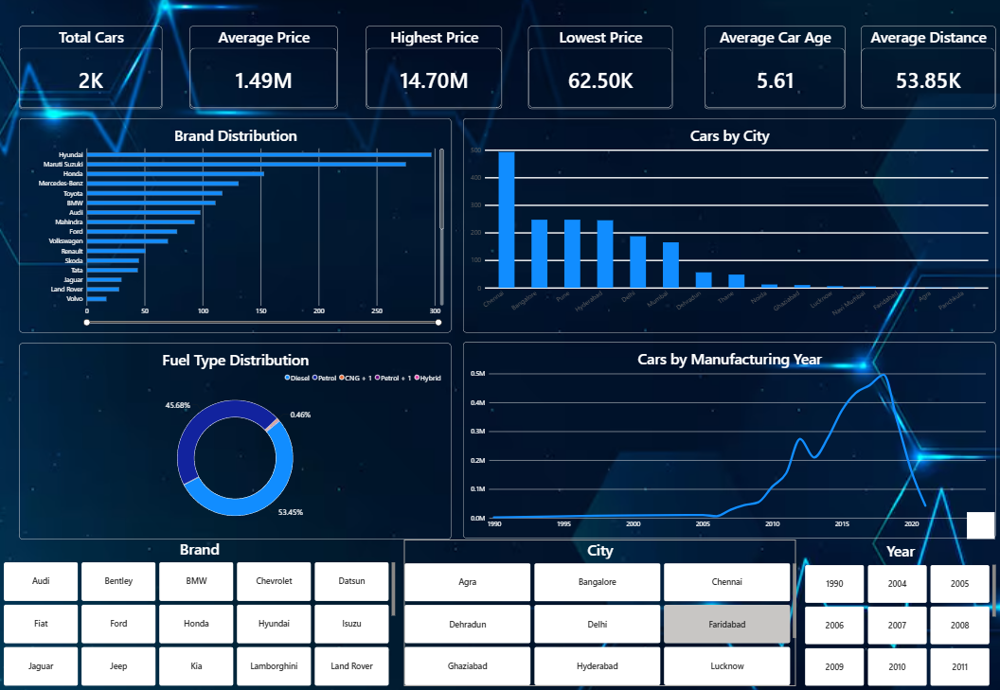
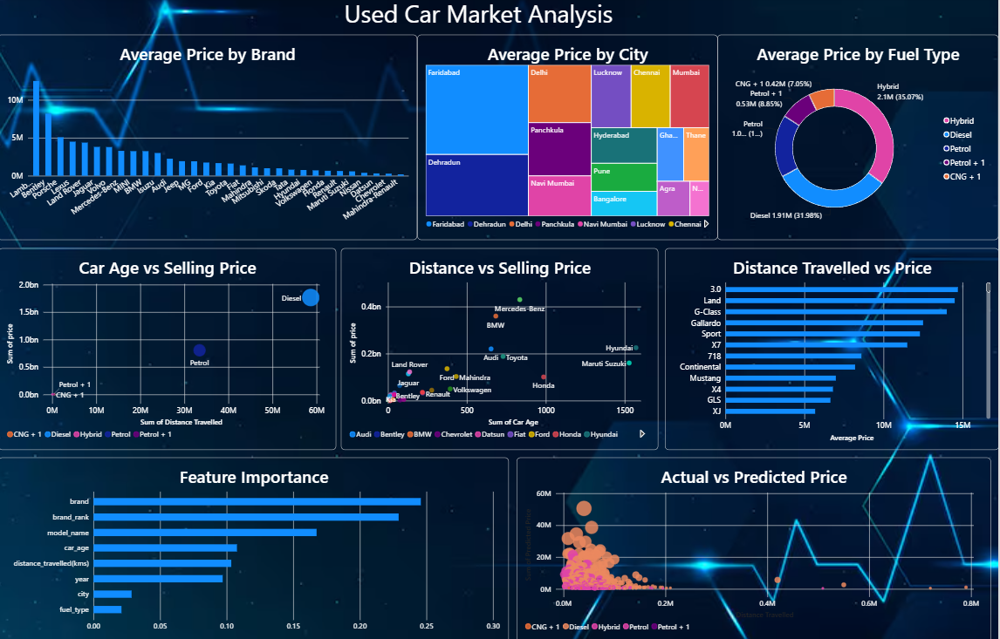
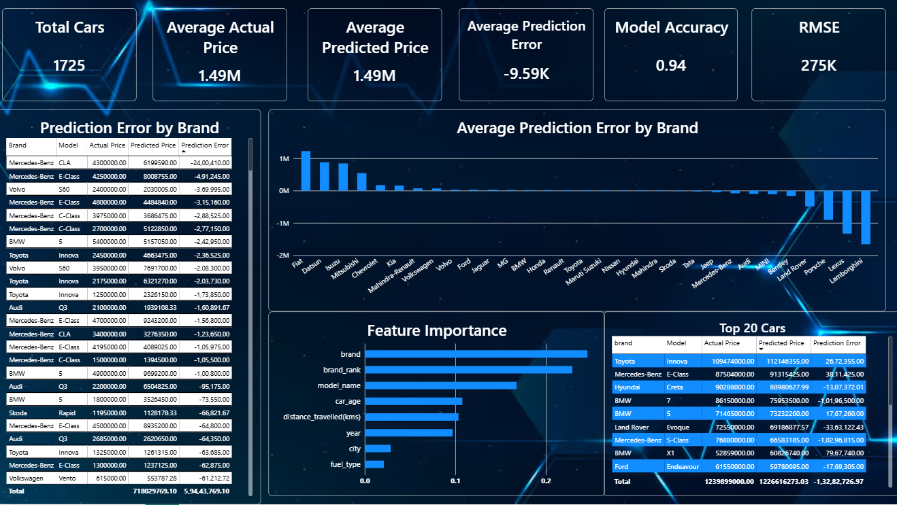

# 🚗 Used Car Price Prediction & Business Intelligence Dashboard

## 📌 Project Overview

This project predicts used car prices using Machine Learning and presents business insights through an interactive Power BI dashboard.

## 📊 Dashboard Pages

### Page 1 – Executive Dashboard
- Total Cars
- Average Price
- Highest & Lowest Price
- Brand Distribution
- Fuel Type Analysis
- Cars by City
- Manufacturing Year Analysis

### Page 2 – Market Analysis
- Average Price by Brand
- Average Price by Fuel Type
- Average Price by City
- Distance vs Price
- Car Age vs Price
- Top 10 Expensive Models

### Page 3 – Prediction Dashboard
- Actual vs Predicted Price
- Feature Importance
- Prediction Error by Brand
- Prediction Error Distribution
- Top 20 Cars Prediction Table
- Model Performance (MAE & RMSE)

---

## 🛠️ Technologies Used

- Python
- Pandas
- NumPy
- Scikit-learn
- Power BI
- DAX
- Excel

---

## 🤖 Machine Learning Model

- Algorithm: Random Forest Regressor
- MAE: 185000
- RMSE: 275000

---

## 📂 Project Structure

```
Dashboard/
Dataset/
Notebook/
Screenshots/
```

---

## 📷 Dashboard Preview

### Executive Dashboard



---

### Market Analysis Dashboard



---

### Prediction Dashboard


---

## 👤 Author

**Vinesh Sivakumar**

- GitHub: https://github.com/vineshs05
